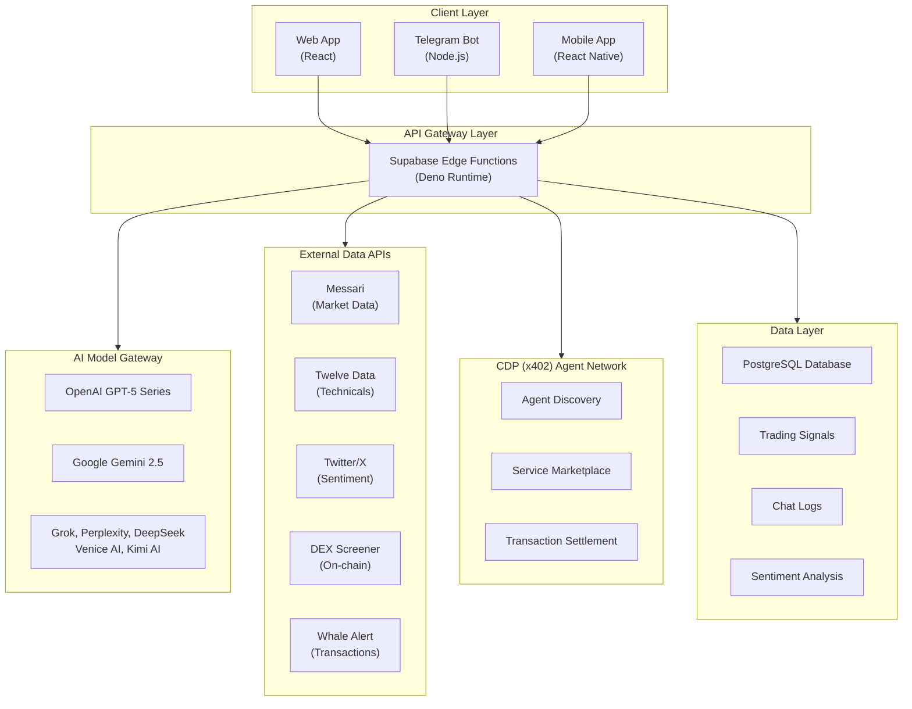
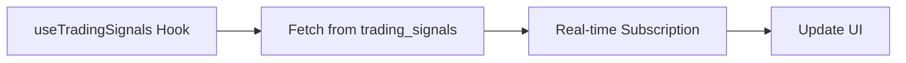
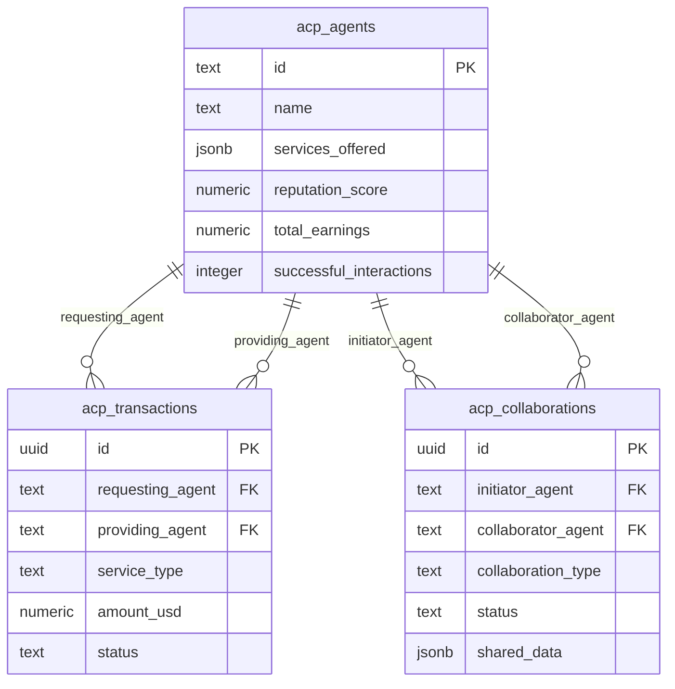

# Apollo AI v3.0 - Technical Documentation

## Executive Summary

Apollo AI v3.0 is an advanced cryptocurrency trading intelligence platform that combines multi-model AI analysis, real-time market data, sentiment tracking, and whale monitoring to provide actionable trading signals and market insights.

**Key Capabilities:**
- Multi-AI model integration (GPT-5, Gemini 2.5, Grok, Perplexity, DeepSeek, Venice, Kimi)
- Real-time trading signal generation with confidence scoring
- Social sentiment analysis from Twitter/X and news sources
- Whale transaction monitoring and alerts
- CDP (x402) agent collaboration network
- Telegram bot integration for mobile alerts
- Live on Virtuals Protocol (Base Chain)

**Technology Foundation:**
- Frontend: React 18.3.1 + TypeScript + Tailwind CSS
- Backend: PostgreSQL + Supabase Edge Functions (Deno)
- Real-time: WebSocket subscriptions
- Blockchain: Base Chain (EVM-compatible)
- Token: APL (ERC-20) - LIVE

---

## Table of Contents

1. [System Architecture](#1-system-architecture)
2. [Setup & Installation](#2-setup--installation)
3. [Core Components](#3-core-components)
4. [API Documentation](#4-api-documentation)
5. [CDP (x402) Integration Guide](#5-cdp-x402-integration-guide)
6. [Database Schema](#6-database-schema)
7. [Edge Functions](#7-edge-functions)
8. [Frontend Integration](#8-frontend-integration)
9. [Telegram Bot](#9-telegram-bot)
10. [Testing & Debugging](#10-testing--debugging)
11. [Deployment](#11-deployment)
12. [Security Best Practices](#12-security-best-practices)
13. [Troubleshooting](#13-troubleshooting)
14. [Support & Resources](#14-support--resources)

---

## 1. System Architecture

### 1.1 High-Level Architecture

**System Architecture Diagram:**



**Architecture Layers:**

1. **Client Layer**: Web application (React), Telegram Bot (Node.js), Mobile app (React Native)
2. **API Gateway Layer**: Supabase Edge Functions (Deno runtime)
3. **AI Model Gateway**: Multi-model AI integration (OpenAI, Gemini, Grok, Perplexity, DeepSeek, Venice, Kimi)
4. **External Data APIs**: Market data, technicals, sentiment, on-chain data, whale tracking
5. **CDP Agent Network**: Agent discovery, service marketplace, transaction settlement
6. **Data Layer**: PostgreSQL database with trading signals, chat logs, sentiment analysis

### 1.2 Technology Stack

| Layer | Technology | Version |
|-------|------------|---------|
| Frontend | React | 18.3.1 |
| State Management | TanStack Query | 5.56.2 |
| Styling | Tailwind CSS | 3.x |
| Web3 | Wagmi | 2.14.7 |
| Backend | Supabase Edge Functions | Deno 1.38+ |
| Database | PostgreSQL | 15+ |
| Real-time | WebSocket | Supabase Realtime |
| Telegram Bot | Node.js + node-telegram-bot-api | 18+ / 0.64.0 |
| AI Gateway | Multiple providers | Various |
| Blockchain | Virtuals Protocol (Base) | EVM-compatible |
| Token | APL (ERC-20) | LIVE |

---

## 2. Setup & Installation

### 2.1 Prerequisites

**Required Software:**
- Node.js 18 or higher
- npm or yarn package manager
- Git version control
- Supabase CLI (optional but recommended)
- Telegram Bot Token (for bot features)

### 2.2 Environment Variables

Create `.env` file in the project root:

```bash
# Backend Configuration
VITE_SUPABASE_URL=your_backend_project_url
VITE_SUPABASE_ANON_KEY=your_anon_key

# API Keys (stored in backend secrets management system)
# These are managed through your backend secrets system, not in .env
# MESSARI_API_KEY
# TWELVEDATA_API_KEY  
# OPENAI_API_KEY
# ANTHROPIC_API_KEY
# GROK_API_KEY
# PERPLEXITY_API_KEY
# DEEPSEEK_API_KEY
# VENICE_API_KEY
# KIMI_API_KEY
# TWITTER_BEARER_TOKEN
# TELEGRAM_BOT_TOKEN
```

### 2.3 Installation Steps

```bash
# Clone repository
git clone https://github.com/ApolloAgent/apollo-ai-v2.git
cd apollo-ai-v2

# 2. Install dependencies
npm install

# 3. Set up backend database (PostgreSQL)
# - Configure your PostgreSQL database instance
# - Set environment variables in .env
# - Copy backend URL and API keys to .env

# 4. Run database migrations
# Migrations are in supabase/migrations/
# Apply them to your PostgreSQL instance

# 5. Configure API keys
# Add API keys to your backend secrets management system

# 6. Start development server
npm run dev

# 7. (Optional) Set up Telegram bot
cd telegram-bot
npm install
node pro-trading-bot.js
```

### 2.4 Database Setup

**Create the following tables:**

Run the migration files in `supabase/migrations/` directory:

```sql
-- Key tables are already defined in migrations
-- trading_signals
-- chat_logs
-- sentiment_analysis
-- technical_patterns
-- acp_agents
-- acp_transactions
-- acp_collaborations
```

**Configure Row-Level Security (RLS):**

Security policies are defined in migration files. Apply them to your database.

**Deploy Backend Functions:**

Deploy serverless functions to your edge runtime:

```bash
# Deploy all functions
supabase functions deploy apollo-chat
supabase functions deploy trading-signals
supabase functions deploy sentiment-tracker
supabase functions deploy whale-alerts
supabase functions deploy advanced-signal-generator
```

---

## 3. Core Components

### 3.1 Apollo Terminal Component

**File:** `src/components/Terminal.tsx`

Main chat interface for interacting with Apollo AI.

```typescript
import { Terminal } from "@/components/Terminal";

// Usage
<Terminal />
```

**Key Features:**
- Multi-model AI selection
- Real-time message streaming
- Market data display
- Sentiment analysis
- Technical patterns
- Whale movements

### 3.2 Trading Signals Dashboard

**File:** `src/components/trading/TradingSignalsDashboard.tsx`

Displays active trading signals with real-time updates.

```typescript
import { TradingSignalsDashboard } from "@/components/trading/TradingSignalsDashboard";

<TradingSignalsDashboard />
```

**Data Flow:**



### 3.3 Sentiment Dashboard

**File:** `src/components/trading/SentimentDashboard.tsx`

Visualizes social sentiment and market mood.

```typescript
import { SentimentDashboard } from "@/components/trading/SentimentDashboard";

<SentimentDashboard symbol="BTC" />
```

### 3.4 Whale Monitor

**File:** `src/components/whale/WhaleMonitor.tsx`

Tracks large cryptocurrency transactions in real-time.

```typescript
import { WhaleMonitor } from "@/components/whale/WhaleMonitor";

<WhaleMonitor />
```

### 3.5 ACP Agent Dashboard

**File:** `src/components/acp/ACPAgentDashboard.tsx`

Manages CDP (x402) agent interactions and collaborations.

```typescript
import { ACPAgentDashboard } from "@/components/acp/ACPAgentDashboard";

<ACPAgentDashboard />
```

---

## 4. API Documentation

### 4.1 Apollo Chat API

**Endpoint:** `/functions/v1/apollo-chat`

**Method:** POST

**Request:**
```json
{
  "message": "What's the price of Bitcoin?",
  "model": "gemini",
  "timeframe": "24h"
}
```

**Response:**
```json
{
  "analysis": "Bitcoin is currently trading at $67,420...",
  "marketData": {
    "symbol": "BTCUSDT",
    "price": 67420.50,
    "change24h": 2.4,
    "volume": 28500000000
  },
  "newsData": [
    {
      "title": "Bitcoin ETF sees record inflows",
      "source": "CoinDesk",
      "sentiment": "positive"
    }
  ]
}
```

### 4.2 Trading Signals API

**Endpoint:** `/functions/v1/trading-signals`

**Method:** POST

**Request:**
```json
{
  "action": "generate",
  "symbols": ["BTC", "ETH", "SOL"],
  "timeframe": "4h"
}
```

**Response:**
```json
{
  "signals": [
    {
      "id": "uuid",
      "symbol": "BTC",
      "signal_type": "BUY",
      "entry_price": 67420,
      "target_price": 72000,
      "stop_loss": 64500,
      "confidence_score": 85,
      "reasoning": "Strong bullish momentum with RSI recovery...",
      "created_at": "2025-01-10T12:00:00Z",
      "expires_at": "2025-01-11T12:00:00Z"
    }
  ]
}
```

### 4.3 Sentiment Analysis API

**Endpoint:** `/functions/v1/sentiment-tracker`

**Method:** POST

**Request:**
```json
{
  "symbol": "BTC",
  "sources": ["twitter", "news"],
  "timeframe": "24h"
}
```

**Response:**
```json
{
  "symbol": "BTC",
  "overall_sentiment": "bullish",
  "sentiment_score": 0.72,
  "social_volume": 45820,
  "top_keywords": ["ETF", "halving", "institutional"],
  "sentiment_breakdown": {
    "bullish": 65,
    "neutral": 25,
    "bearish": 10
  },
  "recent_tweets": [...]
}
```

### 4.4 Whale Alerts API

**Endpoint:** `/functions/v1/whale-alerts`

**Method:** GET

**Query Parameters:**
- `symbol` - Crypto symbol (e.g., "BTC")
- `min_value` - Minimum transaction value in USD
- `limit` - Number of results

**Response:**
```json
{
  "whale_movements": [
    {
      "id": "uuid",
      "crypto_symbol": "BTC",
      "amount": 850.5,
      "usd_value": 57345000,
      "transaction_type": "transfer",
      "from_address": "0x123...",
      "to_address": "0x456...",
      "blockchain": "Bitcoin",
      "timestamp": "2025-01-10T11:45:00Z"
    }
  ]
}
```

---

## 5. CDP (x402) Integration Guide

### 5.1 What is CDP Agent Protocol?

The Coinbase Developer Platform (CDP) introduces ACP (Agent Communication Protocol), also known as x402, which enables:

- **Agent Discovery:** Find available AI/trading agents
- **Service Marketplace:** Agents offer services for fees
- **Collaboration:** Agents work together to solve complex tasks
- **Payment Settlement:** Automated on-chain payments

### 5.2 ACP Agent Registration

**File:** `supabase/functions/acp-agent-register/index.ts`

```typescript
import { serve } from "https://deno.land/std@0.168.0/http/server.ts";
import { createClient } from "https://esm.sh/@supabase/supabase-js@2";

serve(async (req) => {
  const { agent_name, services_offered, pricing } = await req.json();
  
  const supabase = createClient(
    Deno.env.get("SUPABASE_URL")!,
    Deno.env.get("SUPABASE_SERVICE_ROLE_KEY")!
  );
  
  // Register agent in database
  const { data, error } = await supabase
    .from("acp_agents")
    .insert({
      name: agent_name,
      services_offered: services_offered,
      reputation_score: 0,
      total_earnings: 0
    })
    .select()
    .single();
    
  if (error) throw error;
  
  // Register on CDP network (to be implemented)
  // const cdpRegistration = await registerWithCDP(data);
  
  return new Response(JSON.stringify({ agent: data }), {
    headers: { "Content-Type": "application/json" }
  });
});
```

### 5.3 Agent Discovery

**Find available agents:**

```typescript
async function discoverAgents(serviceType: string) {
  const { data: agents } = await supabase
    .from("acp_agents")
    .select("*")
    .contains("services_offered", [serviceType])
    .order("reputation_score", { ascending: false })
    .limit(10);
    
  return agents;
}

// Example usage
const sentimentAgents = await discoverAgents("sentiment_analysis");
```

### 5.4 Agent Collaboration

**Request service from another agent:**

```typescript
async function requestAgentService(
  requestingAgent: string,
  providingAgent: string,
  serviceType: string,
  params: any
) {
  // Create collaboration record
  const { data: collaboration } = await supabase
    .from("acp_collaborations")
    .insert({
      initiator_agent: requestingAgent,
      collaborator_agent: providingAgent,
      collaboration_type: serviceType,
      status: "active",
      shared_data: params
    })
    .select()
    .single();
  
  // Call the agent's service (via CDP network)
  // const result = await callCDPAgent(providingAgent, serviceType, params);
  
  // Log transaction
  await supabase.from("acp_transactions").insert({
    requesting_agent: requestingAgent,
    providing_agent: providingAgent,
    service_type: serviceType,
    amount_usd: calculateFee(serviceType),
    status: "completed"
  });
  
  return collaboration;
}
```

### 5.5 CDP Network Communication (Coming Soon)

```typescript
// Pseudo-code for CDP integration
import { CDPClient } from "@coinbase/cdp-sdk";

const cdp = new CDPClient({
  apiKey: Deno.env.get("COINBASE_CDP_KEY"),
  network: "base"
});

// Register Apollo as an agent
await cdp.agents.register({
  name: "Apollo AI v2.0",
  capabilities: [
    "market_analysis",
    "sentiment_tracking", 
    "signal_generation",
    "whale_monitoring"
  ],
  pricing: {
    market_analysis: "0.001 ETH",
    sentiment_tracking: "0.0005 ETH"
  }
});

// Discover other agents
const agents = await cdp.agents.discover({
  capability: "price_prediction",
  minReputation: 0.8
});

// Request service
const result = await cdp.agents.call(agents[0].id, {
  method: "predictPrice",
  params: { symbol: "BTC", timeframe: "24h" }
});
```

### 5.6 Agent Reputation System

Track agent performance and reliability:

```typescript
async function updateAgentReputation(
  agentId: string,
  transactionSuccess: boolean,
  responseTime: number
) {
  const { data: agent } = await supabase
    .from("acp_agents")
    .select("*")
    .eq("id", agentId)
    .single();
    
  const newScore = calculateReputationScore(
    agent.reputation_score,
    transactionSuccess,
    responseTime,
    agent.successful_interactions
  );
  
  await supabase
    .from("acp_agents")
    .update({
      reputation_score: newScore,
      successful_interactions: agent.successful_interactions + 1
    })
    .eq("id", agentId);
}
```

---

## 6. Database Schema

### 6.1 Core Tables

**trading_signals**
```sql
CREATE TABLE trading_signals (
  id UUID PRIMARY KEY DEFAULT gen_random_uuid(),
  symbol VARCHAR NOT NULL,
  signal_type VARCHAR NOT NULL CHECK (signal_type IN ('BUY', 'SELL', 'HOLD')),
  entry_price NUMERIC NOT NULL,
  target_price NUMERIC,
  stop_loss NUMERIC,
  confidence_score NUMERIC NOT NULL,
  reasoning TEXT,
  timeframe VARCHAR NOT NULL,
  technical_indicators JSONB,
  whale_activity JSONB,
  sentiment_data JSONB,
  status VARCHAR DEFAULT 'active',
  created_at TIMESTAMPTZ DEFAULT NOW(),
  expires_at TIMESTAMPTZ NOT NULL,
  updated_at TIMESTAMPTZ DEFAULT NOW()
);

CREATE INDEX idx_trading_signals_symbol ON trading_signals(symbol);
CREATE INDEX idx_trading_signals_status ON trading_signals(status);
CREATE INDEX idx_trading_signals_created_at ON trading_signals(created_at);
```

**acp_agents**
```sql
CREATE TABLE acp_agents (
  id TEXT PRIMARY KEY,
  name TEXT NOT NULL,
  services_offered JSONB DEFAULT '[]',
  reputation_score NUMERIC DEFAULT 0,
  total_earnings NUMERIC DEFAULT 0,
  successful_interactions INTEGER DEFAULT 0,
  created_at TIMESTAMPTZ DEFAULT NOW(),
  updated_at TIMESTAMPTZ DEFAULT NOW()
);
```

**acp_transactions**
```sql
CREATE TABLE acp_transactions (
  id UUID PRIMARY KEY DEFAULT gen_random_uuid(),
  requesting_agent TEXT NOT NULL,
  providing_agent TEXT NOT NULL,
  service_type TEXT NOT NULL,
  amount_usd NUMERIC NOT NULL,
  status TEXT DEFAULT 'pending',
  metadata JSONB DEFAULT '{}',
  response_time_ms INTEGER,
  created_at TIMESTAMPTZ DEFAULT NOW(),
  completed_at TIMESTAMPTZ
);
```

**acp_collaborations**
```sql
CREATE TABLE acp_collaborations (
  id UUID PRIMARY KEY DEFAULT gen_random_uuid(),
  initiator_agent TEXT NOT NULL,
  collaborator_agent TEXT NOT NULL,
  collaboration_type TEXT NOT NULL,
  status TEXT DEFAULT 'active',
  shared_data JSONB DEFAULT '{}',
  created_at TIMESTAMPTZ DEFAULT NOW(),
  ended_at TIMESTAMPTZ
);
```

### 6.2 Relationships

**Database Entity Relationships:**



---

## 7. Edge Functions

### 7.1 Function Structure

All edge functions follow this pattern:

```typescript
import { serve } from "https://deno.land/std@0.168.0/http/server.ts";

const corsHeaders = {
  "Access-Control-Allow-Origin": "*",
  "Access-Control-Allow-Headers": "authorization, x-client-info, apikey, content-type",
};

serve(async (req) => {
  // Handle CORS preflight
  if (req.method === "OPTIONS") {
    return new Response(null, { headers: corsHeaders });
  }

  try {
    const body = await req.json();
    
    // Your logic here
    const result = await processRequest(body);
    
    return new Response(JSON.stringify(result), {
      headers: { ...corsHeaders, "Content-Type": "application/json" }
    });
  } catch (error) {
    console.error("Error:", error);
    return new Response(JSON.stringify({ error: error.message }), {
      status: 500,
      headers: { ...corsHeaders, "Content-Type": "application/json" }
    });
  }
});
```

### 7.2 Key Functions

| Function Name | Purpose | Cron Schedule |
|--------------|---------|---------------|
| `apollo-chat` | AI chat interface | On-demand |
| `trading-signals` | Generate signals | Every 30 min |
| `advanced-signal-generator` | Complex signal logic | Every 15 min |
| `sentiment-tracker` | Track social sentiment | Every 5 min |
| `whale-alerts` | Monitor large transactions | Real-time |
| `grok-sentiment` | Grok-powered sentiment | Every 10 min |
| `technical-patterns` | Pattern recognition | Every 15 min |
| `update-signal-performance` | Track signal accuracy | Daily |

### 7.3 Cron Configuration

**File:** `supabase/config.toml`

```toml
[functions.trading-signals]
verify_jwt = false

[functions.trading-signals.cron]
schedule = "*/30 * * * *"  # Every 30 minutes

[functions.sentiment-tracker]
verify_jwt = false

[functions.sentiment-tracker.cron]
schedule = "*/5 * * * *"  # Every 5 minutes
```

---

## 8. Frontend Integration

### 8.1 React Query Setup

**File:** `src/App.tsx`

```typescript
import { QueryClient, QueryClientProvider } from "@tanstack/react-query";

const queryClient = new QueryClient({
  defaultOptions: {
    queries: {
      staleTime: 30000, // 30 seconds
      refetchOnWindowFocus: false
    }
  }
});

function App() {
  return (
    <QueryClientProvider client={queryClient}>
      <YourApp />
    </QueryClientProvider>
  );
}
```

### 8.2 Custom Hooks

**useTradingSignals.ts**
```typescript
import { useQuery } from "@tanstack/react-query";
import { supabase } from "@/integrations/supabase/client";

export const useTradingSignals = () => {
  return useQuery({
    queryKey: ["trading-signals"],
    queryFn: async () => {
      const { data, error } = await supabase
        .from("trading_signals")
        .select("*")
        .eq("status", "active")
        .order("created_at", { ascending: false });
        
      if (error) throw error;
      return data;
    },
    refetchInterval: 60000 // 1 minute
  });
};
```

**useACPAgents.ts**
```typescript
export const useACPAgents = () => {
  return useQuery({
    queryKey: ["acp-agents"],
    queryFn: async () => {
      const { data, error } = await supabase
        .from("acp_agents")
        .select("*")
        .order("reputation_score", { ascending: false });
        
      if (error) throw error;
      return data;
    }
  });
};
```

### 8.3 Real-time Subscriptions

```typescript
useEffect(() => {
  const channel = supabase
    .channel("trading-signals-changes")
    .on(
      "postgres_changes",
      {
        event: "*",
        schema: "public",
        table: "trading_signals"
      },
      (payload) => {
        console.log("Signal updated:", payload);
        queryClient.invalidateQueries(["trading-signals"]);
      }
    )
    .subscribe();
    
  return () => {
    supabase.removeChannel(channel);
  };
}, []);
```

---

## 9. Telegram Bot

### 9.1 Bot Architecture

**File:** `telegram-bot/pro-trading-bot.js`

Main features:
- Real-time trading signals
- Price alerts
- Sentiment updates
- Whale tracking
- Custom watchlists

### 9.2 Bot Commands

| Command | Description |
|---------|-------------|
| `/start` | Initialize bot |
| `/signals` | Get latest trading signals |
| `/price [symbol]` | Get current price |
| `/sentiment [symbol]` | Get sentiment analysis |
| `/whales` | Recent whale movements |
| `/watchlist` | Manage watchlist |
| `/forecast [symbol]` | AI price prediction |
| `/topgainers` | Top performing cryptos |

### 9.3 Bot Setup

```bash
cd telegram-bot
npm install

# Create .env file
TELEGRAM_BOT_TOKEN=your_bot_token
SUPABASE_URL=your_backend_api_url
SUPABASE_KEY=your_api_key

# Run bot
node pro-trading-bot.js
```

### 9.4 Signal Notifications

```javascript
async function notifyTradingSignals() {
  const { data: signals } = await supabase
    .from("trading_signals")
    .select("*")
    .eq("status", "active")
    .order("created_at", { ascending: false })
    .limit(5);
    
  for (const signal of signals) {
    const message = formatSignalMessage(signal);
    await bot.sendMessage(CHANNEL_ID, message, { parse_mode: "HTML" });
  }
}
```

---

## 10. Testing & Debugging

### 10.1 Unit Tests

```bash
# Run tests
npm test

# Coverage
npm run test:coverage
```

### 10.2 Edge Function Testing

```bash
# Test locally
supabase functions serve apollo-chat

# Test with curl
curl -X POST http://localhost:54321/functions/v1/apollo-chat \
  -H "Content-Type: application/json" \
  -d '{"message": "What is BTC price?"}'
```

### 10.3 Database Testing

```sql
-- Test signal generation
SELECT * FROM trading_signals
WHERE created_at > NOW() - INTERVAL '1 hour'
ORDER BY confidence_score DESC;

-- Test ACP agents
SELECT * FROM acp_agents
ORDER BY reputation_score DESC;

-- Test performance
SELECT 
  symbol,
  AVG(confidence_score) as avg_confidence,
  COUNT(*) as total_signals
FROM trading_signals
GROUP BY symbol;
```

### 10.4 Logging

**Edge Function Logs:**
```bash
supabase functions logs apollo-chat --tail
```

**Application Logs:**
```typescript
console.log("[Apollo]", message);
console.error("[Apollo Error]", error);
```

---

## 11. Deployment

### 11.1 Production Checklist

- [ ] All environment variables configured
- [ ] Database migrations applied
- [ ] Edge functions deployed
- [ ] RLS policies verified
- [ ] API rate limits configured
- [ ] Cron jobs activated
- [ ] Telegram bot running
- [ ] Monitoring setup
- [ ] Backup strategy in place
- [ ] Security audit completed

### 11.2 Deploy Edge Functions

```bash
# Deploy all functions
supabase functions deploy

# Deploy specific function
supabase functions deploy apollo-chat
```

### 11.3 Frontend Deployment

```bash
# Build for production
npm run build

# Preview
npm run preview

# Deploy to hosting (e.g., Vercel, Netlify)
vercel deploy
# or
netlify deploy
```

### 11.4 Database Backup

```bash
# Backup database
supabase db dump > backup.sql

# Restore
psql your_database < backup.sql
```

---

## 12. Security Best Practices

### 12.1 API Key Management

- **Never** commit API keys to Git
- Store in backend secrets management system
- Use environment variables for frontend
- Rotate keys regularly
- Use separate keys for dev/prod

### 12.2 Row-Level Security

Always enable RLS on tables containing user data:

```sql
ALTER TABLE user_portfolio ENABLE ROW LEVEL SECURITY;

CREATE POLICY "Users can only access their own portfolio"
ON user_portfolio
FOR ALL
USING (auth.uid()::text = user_id);
```

### 12.3 Rate Limiting

Implement on edge functions:

```typescript
const rateLimiter = new Map();

function checkRateLimit(userId: string): boolean {
  const now = Date.now();
  const userRequests = rateLimiter.get(userId) || [];
  
  // Filter last minute
  const recentRequests = userRequests.filter(
    (time: number) => now - time < 60000
  );
  
  if (recentRequests.length >= 100) {
    return false; // Rate limit exceeded
  }
  
  recentRequests.push(now);
  rateLimiter.set(userId, recentRequests);
  return true;
}
```

### 12.4 Input Validation

Always validate user input:

```typescript
import { z } from "zod";

const SignalRequestSchema = z.object({
  symbol: z.string().min(2).max(10),
  timeframe: z.enum(["1h", "4h", "1d"]),
  model: z.string().optional()
});

const validated = SignalRequestSchema.parse(requestBody);
```

### 12.5 SQL Injection Prevention

Use parameterized queries:

```typescript
// Good
const { data } = await supabase
  .from("trading_signals")
  .select("*")
  .eq("symbol", userInput);

// Bad - DON'T DO THIS
const query = `SELECT * FROM trading_signals WHERE symbol = '${userInput}'`;
```

---

## 13. Troubleshooting

### 13.1 Common Issues

**Issue: Edge function not responding**
- Check function logs in your backend dashboard
- Verify API keys in secrets management system
- Check CORS headers

**Issue: Real-time subscriptions not working**
- Enable Realtime in your backend configuration
- Check RLS policies
- Verify channel name

**Issue: Database connection errors**
- Check backend service status
- Verify connection string
- Check RLS policies

**Issue: Telegram bot not responding**
- Verify bot token
- Check bot is running
- Review bot logs

---

## 14. Support & Resources

### 14.1 Official Links

- **GitHub Repository:** https://github.com/ApolloAgent
- **Twitter/X:** https://x.com/Apollo_Virtuals
- **Telegram Community:** https://t.me/ApolloAI_Virtuals
- **Warpcast:** https://warpcast.com/apolloai

### 14.2 Network Information

- **Blockchain:** Virtuals Protocol (Base Chain)
- **Token:** APL (ERC-20)
- **Token Status:** LIVE & Deployed
- **Network Type:** EVM-compatible

### 14.3 Technical Support

For technical support, bug reports, or feature requests:
1. Open an issue on GitHub
2. Join our Telegram community
3. Follow updates on Twitter/X

---

## Document Information

| Property | Value |
|----------|-------|
| **Version** | 3.0.0 |
| **Last Updated** | October 2025 |
| **Network** | Virtuals Protocol (Base Chain) |
| **Token Status** | LIVE |
| **Maintained By** | Apollo AI Development Team |
| **License** | MIT |

---

**End of Documentation**
